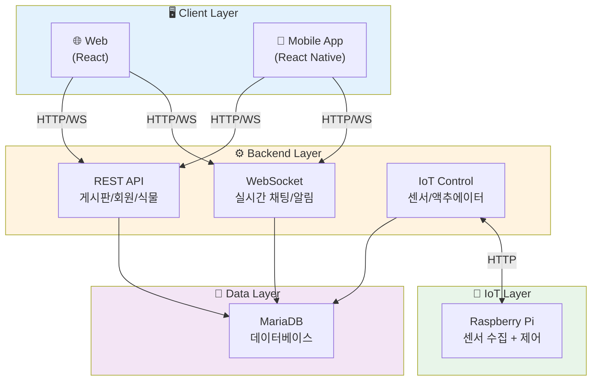

# 🌿 GitHerb

> IoT 기반 스마트 식물 관리 & 소셜 커뮤니티 플랫폼

## 📋 프로젝트 개요

GitHerb는 라즈베리파이와 각종 센서를 활용한 **스마트 식물 관리 시스템**과 **식물 애호가들을 위한 소셜 커뮤니티**를 결합한 풀스택 프로젝트입니다.

실시간으로 식물의 환경 데이터(온도, 습도, 조도, 토양습도)를 수집하고, 사용자가 웹과 앱에서 식물 상태를 확인하며 원격으로 워터펌프, LED, 팬 등을 제어할 수 있습니다. 또한 게시판, 채팅, 팔로우 등 커뮤니티 기능을 통해 다른 사용자들과 식물 키우기 경험을 공유할 수 있습니다.

---

## 🏗️ 레포지토리

| 구분 | 레포지토리 | 기술 스택 |
|------|-----------|----------|
| **📱 App** | [github 바로가기](https://github.com/YOUR-USERNAME/app-repo) | React Native, Expo |
| **🎨 Frontend** | [github 바로가기](https://github.com/YOUR-USERNAME/frontend-repo) | React, Axios, Socket.io |
| **⚙️ Backend** | [github 바로가기](https://github.com/YOUR-USERNAME/backend-repo) | Java 17, Spring Boot, MyBatis, MariaDB |
| **🔧 IoT** | [github 바로가기](https://github.com/YOUR-USERNAME/iot-repo) | Python, Raspberry Pi |

---

## 🎯 주요 기능

### 📅 식물 관리 캘린더 (담당 기능)
- **물주기 일정 관리**: 식물별 물주기 날짜 등록 및 자동 추천
- **관리 일기**: 물주기, 비료, 분갈이 등 관리 내역 기록
- **푸시 알림**: 물주기 시간 앱 푸시 알림 (React Native)
- **통계**: 월별/연도별 관리 이력 조회

### 🌱 IoT 기반 식물 관리
- 실시간 환경 모니터링 (온도, 습도, 조도, 토양습도)
- 액추에이터 원격 제어 (워터펌프, LED, 팬)
- 자동/수동 제어 모드

### 👥 소셜 커뮤니티
- 게시판 (식물 자랑, 재배 팁, Q&A)
- 팔로우/좋아요/댓글
- 실시간 채팅 (WebSocket)

### 🌤️ 기타 기능
- 기상청 API 연동
- 크로스 플랫폼 지원 (Web + Mobile App)

---

## 🛠️ 기술 스택

### Backend
**Spring Boot 3.4** | **Java 17** | **MyBatis** | **MariaDB** | **WebSocket** | **Lombok**

### Frontend
**React 18** | **Axios** | **React Router** | **Socket.io** | **Chart.js**

### Mobile App
**React Native** | **Expo** | **Redux Toolkit** | **React Navigation**

### IoT
**Python** | **Raspberry Pi** | **센서/액추에이터**

---

## 🏗️ 시스템 아키텍처



---

## 📂 프로젝트 구조

### Backend
```
src/main/java/com/green/backend_plant_comunity/
├── board/              # 게시판 (일반/Q&A)
├── member/             # 회원 관리
├── plant/              # 식물 정보
├── calendar/           # 물주기 캘린더
├── environment/        # 환경 센서 데이터 & IoT 제어
├── chat/               # 실시간 채팅
├── message/            # 1:1 메시지
├── comment/            # 댓글
├── like/               # 좋아요
├── follow/             # 팔로우
├── notification/       # 알림
├── weather/            # 기상청 API
└── config/             # 설정 (CORS, WebSocket)
```

### Frontend
```
src/
├── components/         # 재사용 컴포넌트
├── pages/              # 페이지 컴포넌트
├── services/           # API 서비스
├── hooks/              # 커스텀 훅
└── styles/             # 스타일
```

### Mobile App
```
src/
├── components/         # 재사용 컴포넌트
├── screens/            # 화면 컴포넌트
├── navigation/         # 네비게이션
├── store/              # Redux
└── services/           # API 서비스
```

---

## 🚀 시작하기

### Backend
```bash
./gradlew bootRun
# 실행 후: http://localhost:8080
```

### Frontend
```bash
npm install
npm start
# 실행 후: http://localhost:3000
```

### Mobile App
```bash
npm install
npm start
# iOS: npm run ios
# Android: npm run android
```

---

## 🔧 환경 설정

### Backend (`application.properties`)
```properties
spring.datasource.url=jdbc:log4jdbc:mariadb://YOUR-DB-HOST:3306/team_db
spring.datasource.username=your-username
spring.datasource.password=your-password
file.upload-dir=your-upload-path
kakao.api.key=your-kakao-api-key
```

### Frontend (`.env`)
```env
REACT_APP_API_BASE_URL=http://your-backend-url:8080
REACT_APP_SOCKET_URL=ws://your-backend-url:8080/ws
```

### Mobile App (`.env`)
```env
API_BASE_URL=http://your-backend-url:8080
SOCKET_URL=ws://your-backend-url:8080/ws
```

---

## 📡 주요 API

### 환경 센서
- `GET /environment` - 센서 데이터 조회
- `GET /environment/realtime/{raspNum}` - 실시간 데이터

### 액추에이터 제어
- `POST /control/control` - 액추에이터 제어
- `POST /control/mode` - 모드 변경 (AUTO/MANUAL)
- `GET /control/status` - 상태 조회

### 게시판
- `GET /board` - 게시글 목록
- `POST /board` - 게시글 작성
- `GET /board/{id}` - 게시글 상세

### 소셜
- `POST /follow/{userId}` - 팔로우
- `POST /like/board/{boardId}` - 좋아요
- `POST /comment` - 댓글 작성

---

## 👥 팀

**GitHerb Team** - 식물과 기술을 사랑하는 개발자들

---

**Made with 💚 by GitHerb Team**
